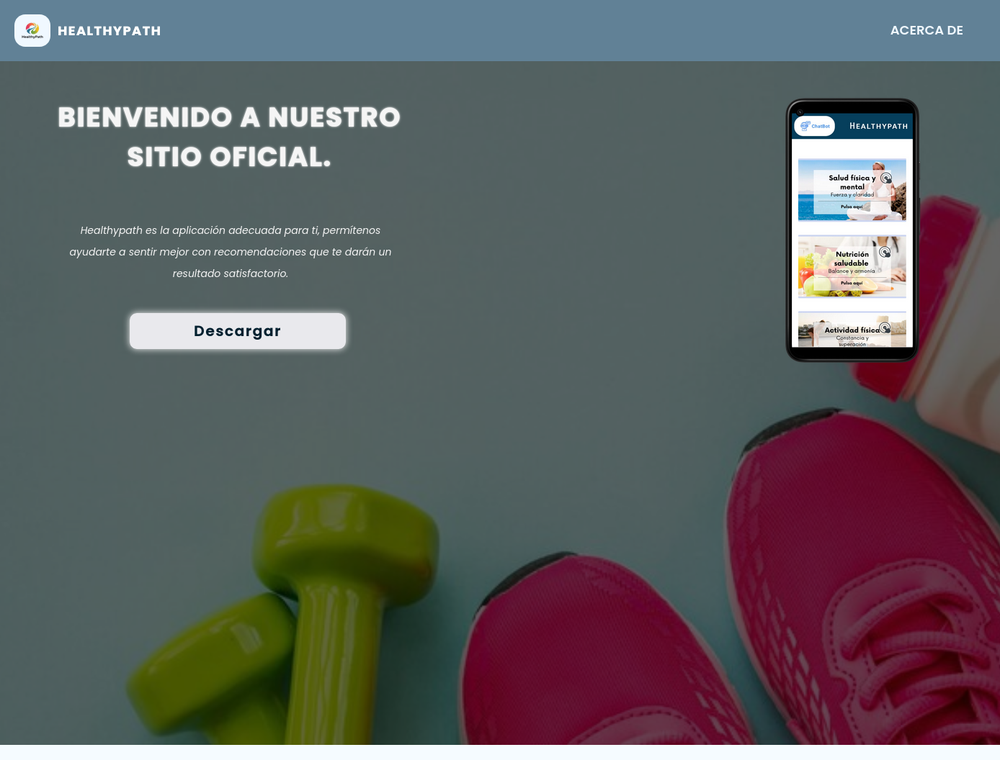

# Healthypath

Sitio web oficial de **Healthypath**, una aplicación móvil de salud y bienestar diseñada para ayudar a las personas a optimizar su estilo de vida.




## Descripción

Healthypath abarca tres áreas clave: **actividad física**, **alimentación** y **sueño**. La aplicación proporciona herramientas como cálculo de IMC, requerimiento proteico y un chatbot interactivo para asesoramiento personalizado. Actualmente en versión beta (V-1.0).

## Contenido del sitio

- **Inicio** (`index.html`): Presentación de la aplicación, secciones principales y descarga del APK
- **Acerca de nosotros** (`about_us.html`): Información del equipo de desarrollo

## Estructura del proyecto

```
Healthypath_portfolio/
├── index.html              # Página principal
├── about_us.html           # Página del equipo de desarrollo
├── styles/                 # Estilos CSS modulares
│   ├── index/              # Estilos de la página principal
│   │   ├── main.css        # Punto de entrada (importa todo)
│   │   ├── layout/         # Header y footer
│   │   ├── sections/       # Hero, info, organigrama, servicios, etc.
│   │   ├── others/         # Global, animaciones, responsive
│   │   └── ui/             # Componentes (grid-bento)
│   └── about/              # Estilos de Acerca de nosotros
│       ├── main.css        # Punto de entrada (importa todo)
│       ├── layout/         # Header y footer
│       └── others/         # Globals, secciones
├── fonts/                  # Fuente Poppins
│   └── poppins/
├── img/                    # Imágenes e iconos
│   ├── desarrolladores/
│   ├── icons/
│   └── views/
└── README.md
```

## Tecnologías

- HTML5
- CSS3 (arquitectura modular por página)
- Fuente Poppins (local)

## Funcionalidades de la aplicación

- Evaluación nutricional (IMC y requerimiento proteico)
- Asesoramiento en hábitos de sueño
- Recomendaciones personalizadas
- Chatbot interactivo para orientación en salud
- Sección de actividad física (aeróbico, gym, calistenia, dieta)

## Equipo de desarrollo

Estudiantes de la Universidad Experimental Politécnica de la Fuerza Armada Nacional (UNEFA), Venezuela, Estado Falcón, Punto Fijo:

- **Gabriel Hernández** — Project Manager
- **Eliecer Medina** — Gerente Financiero
- **Joseini Garcia** — Gerente de Marketing
- **Ronald Higuera** — CEO
- **Luis Alvarez** — Gerente Informático

## Descarga de la aplicación

La APK está disponible en el enlace proporcionado en la página principal.

---

© 2025 Healthypath. Todos los derechos reservados.  
República Bolivariana de Venezuela, Estado Falcón, Punto Fijo.
